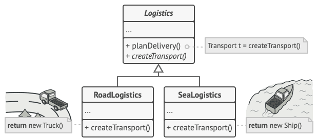

# Factory_method

The "Factory Method" pattern.
The online store's system stores information about peripheral devices: headphones, microphone, keyboard. Each device has a nomenclature number, brand and cost. In addition, the type of construction and mounting method are indicated for headphones, the frequency range and sensitivity for microphones, and the type of switch and interface for the keyboard. 
It is necessary to withdraw: 
1. Complete list of devices. 
2. Information about a specific device. 

## Contents

1. [Information](#information) 
2. [Code](#code) 

## Information

The factory method is a generative design pattern that defines a common interface for creating objects in a superclass, allowing subclasses to change the type of objects being created.
The Factory Method pattern suggests creating objects not directly using the new operator, but by calling a special factory method.

However, there is a slight limitation here: subclasses can return different types of product objects only if these objects share a common base class or interface. In addition, the return type for the factory method in the base class must be declared as this interface.
For example, the Truck and Ship classes implement the Transport interface with the deliver() method. Each of these classes implements this method in its own way: trucks carry goods by land, and ships by sea. The factory method in the RoadLogistic class returns truck objects, and the SeaLogistics class returns ship objects.

Applicability:
- Use the factory method when the types and dependencies of objects that your code should work with are unknown in advance. The factory method separates the product creation code from the rest of the code that uses these products. Thanks to this, the creation code can be expanded without touching the main code. So, to add support for a new product, you need to create a new subclass of the creator and define a factory method in it that returns an instance of the new product.
- Use the factory method when you want to enable users of your framework or library to extend its internal components.
- Use the factory method when you want to save system resources by reusing existing objects instead of re-creating them every time.

## Code

The `PeripheralDevice` class is an abstract base class for various peripheral devices. It contains common properties and methods for all devices:
- `nomenclatureNumber` - an unique device identifier;
- `brand` - a brand of the device;
- `cost` - a cost of the device;
- `count` - a static field used to track the number of objects created;
- `displayInfo()` - a virtual pure function that must be implemented in derived classes to display detailed information about the device;
- `displayDevice()` - a virtual pure function that must be implemented in derived classes to display brief information about the device.

The `Headphones` class is a specific peripheral device - headphones:
- `constructionType` - a headphone design type;
- `mountingMethod` - a method of attaching headphones.

The `Microphone` class is a specific peripheral device - microphone:
- `frequencyRange` - a microphone frequency range;
- `sensitivity` - a microphone sensitivity.

The `Keyboard` class is a specific peripheral device - a keyboard:
- `switchType` - a type of keyboard switch;
- `InterfaceType` - a type of keyboard interface.

The `PeripheralDeviceFactory` class is an interface for creating peripheral devices:
- `createDevice()` - a virtual pure function that must be implemented in derived factory classes to create specific devices.

The `Headphones Factory` class is a factory class for creating objects of the Headphones class.

The `MicrophoneFactory` class is a factory class for creating objects of the Microphone class.

The `KeyboardFactory` class is a factory class for creating objects of the Keyboard class.

>
>fratellou, 2024