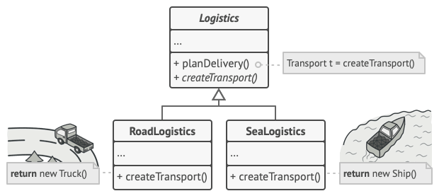
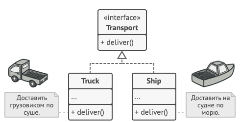

# Factory_method

Паттерн «Фабричный метод» (Factory Method) 
В системе интернет-магазина хранится информация о периферийных устройствах: наушники, микрофон, клавиатура. Каждое устройство имеет номенклатурный номер, бренд и стоимость. Помимо этого, для наушников указывается тип конструкции и метод крепления, для микрофонов – частотный диапазон и чувствительность, для клавиатуры – тип выключателя и интерфейс. 
Необходимо вывести: 
1. Полный список устройств. 
2. Информацию по конкретному устройству. 

## Теория

Фабричный метод – это порождающий паттерн проектирования, который определяет общий интерфейс для создания объектов в суперклассе, позволяя подклассам изменять тип создаваемых объектов.
Паттерн Фабричный метод предлагает создавать объекты не напрямую, используя оператор new, а через вызов специального фабричного метода.

Однако здесь есть небольшое ограничение: подклассы могут возвращать различные типы объектов-продуктов, только если эти объекты имеют общий базовый класс или интерфейс. Кроме того, тип возвращаемого значения для фабричного метода в базовом классе должен быть объявлен как этот интерфейс.
Например, классы Truck (грузовик) и Ship (судно) реализуют интерфейс Transport (транспорт) с методом deliver() (доставить). Каждый из этих классов реализует этот метод по-своему: грузовики везут грузы по земле, а суда – по морю. Фабричный метод в классе RoadLogistic (дорожная логистика) возвращает объекты-грузовики, а класс SeaLogistics (морская логистика) – объекты-суда.

Применимость:
- Используйте фабричный метод, когда заранее неизвестны типы и зависимости объектов, с которыми должен работать ваш код. Фабричный метод отделяет код создания продуктов от остального кода, который эти продукты использует. Благодаря этому, код создания можно расширять, не трогая основной код. Так, чтобы добавить поддержку нового продукта, вам нужно создать новый подкласс создателя и определить в нём фабричный метод, возвращающий экземпляр нового продукта.
- Используйте фабричный метод, когда хотите дать возможность пользователям вашего фреймворка или библиотеки расширять его внутренние компоненты.
- Используйте фабричный метод, когда хотите сэкономить системные ресурсы, повторно используя уже существующие объекты, вместо повторного создания их каждый раз.

